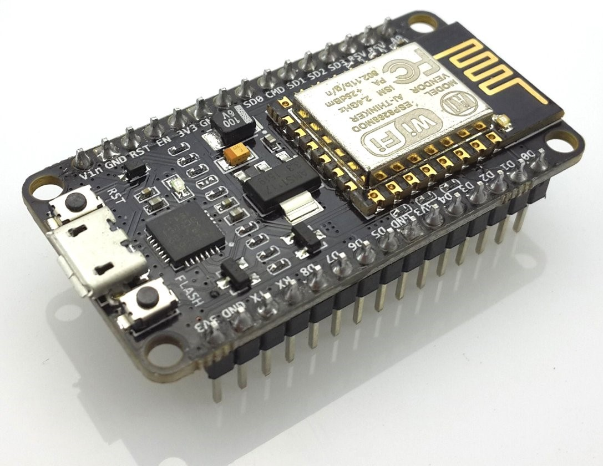
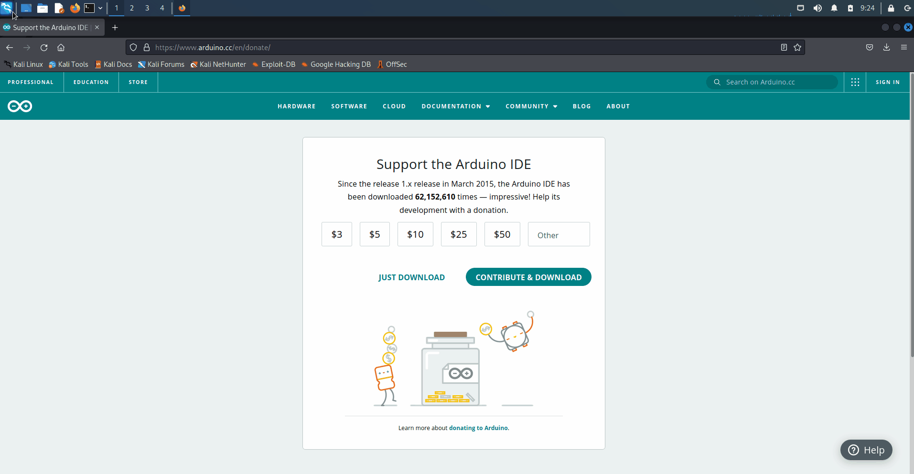
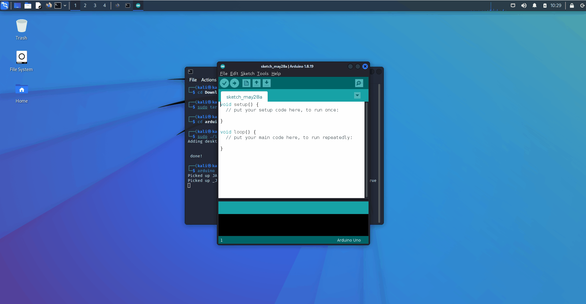
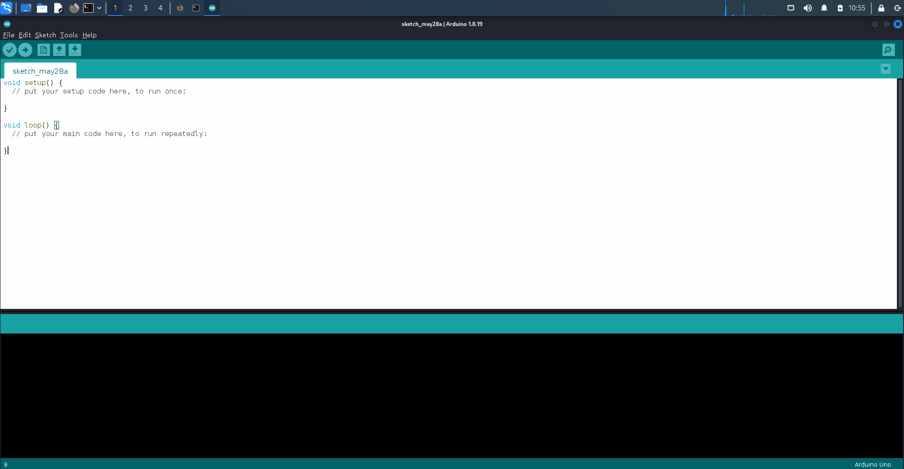

# **Introduction to NodeMCU/ESP8266**
---


#### This is a great microcontroller under $5 to start with when getting into cybersecurity/networking but before anything, let's get our environment going  

---

### Quick Lecture (5 Minutes)

---

### Download Arduino Software on Kali Linux (5 Minutes)
1. Open Browser
2. Go to **https://www.arduino.cc/en/software**
3. Click on "**Linux** 64 Bits"
4. Click on "Just Download"
5. Click on "Save File" then hit "Ok"


---

### Install software (5 Minutes)
1. Open terminal
2. Put the following commands one by one  
```bash
cd Downloads
sudo tar -xf arduino-1.8.19-linux64.tar.xz
cd arduino-1.8.19
sudo ./install.sh
```
3. Now let's verify you have the Arduino software installed by typing ``Arduino`` and hitting Enter
4. The program should then open which then brings us to installing some packages for the microcontroller to work



---

### Installing packages for NodeMCU (10 Minutes)
1. On the top left of the Arduino software hit "File" then "Preferences"
2. Let's add this link ``https://arduino.esp8266.com/stable/package_esp8266com_index.json`` into the "Additional Boards Manager URLs" field
3. Then hit "Ok"
4. Now again on the top left of the Arduino software hit "Tools" then "Board: "Arduino Uno"" (assuming it's your first time with this software) then "Boards Manager..."
5. Where it says "*Filter your search...*" type "ESP8266"
6. Click on where it says "Select version", then select 3.0.1 and hit "Install"
7. Close the "Board Manager" window you have open once install is done, now you're set to upload projects



---

### Explain an ESP8266 example project(5 Minutes)

---

### Test Software on NodeMCU(30 Minutes)
1. On the top left of the Arduino software hit "Tools"
2. Go under "Board: "Arduino Uno"" (assuming it's your first time with this software) and hit "ESP8266 Boards (3.0.1)" then scroll until you can click "NodeMCU 1.0 (ESP-12E Module)"
3. Go back and then click "Port" which should be under the "Tools" section we hit before and then select "/dev/ttyUSB0"
4. On the top left of the Arduino software hit "File"
5. Then hit "Examples" -> "ESP8266" -> "BlinkWithoutDelay"
6. Go to "Tools" and verify it's still using the same port as last time
7. With that done, it's just time to upload the program. You can do so by hitting the button that has an arrow pointing right and says "Upload" once you hover over it.
8. Now just wait for it to do its thing and boom you just uploaded your very first file onto the NodeMCU and it should be flashing if transfer was successful
9. Have some fun and instead of using the "BlinkWithoutDelay" example you can try other examples to prepare yourself for the other labs that will require you to upload code and perhaps tweak.


